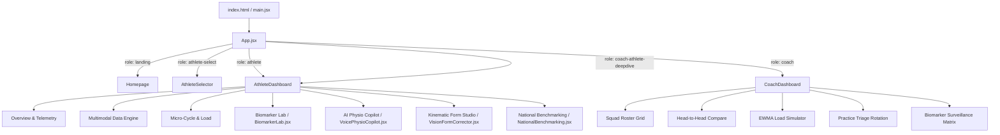

# Product Requirement Document (PRD): Project ASTRA (OlympIQ India)

## Document Metadata
* **Project Name**: Project ASTRA (Advanced Sports Technology & Real-Time Analytics)
* **Target Audience**: Sports Authority of India (SAI), Target Olympic Podium Scheme (TOPS), National Centers of Excellence (NCOE), NIS Patiala
* **Status**: Complete / Core Blueprint Documented
* **Release Version**: v1.0.0
* **Date**: August 18, 2026

---

## 1. Executive Summary & Vision
Project ASTRA is an enterprise-grade sports science dashboard that transforms sports medicine and training workflows from **reactive** (treating athletic injuries post-facto) to **predictive** (forecasting non-contact soft tissue failures 48–72 hours in advance). 

Built specifically for India's high-performance sports units, the platform equips coaches, physiotherapists, and elite athletes with a unified portal. It fuses physiological data from BLE wearables, point-of-care biomaterial assays, 3D computer vision kinematics, and autonomic tracking metrics to build individual profiles geared toward India’s Commonwealth Games 2030 and Olympic Games 2036 mission.

---

## 2. Technical Stack & Infrastructure
* **Frontend Library**: React 19.0
* **Build System**: Vite 6.0
* **Styling Framework**: TailwindCSS 3.4 (with custom CSS in [App.css](file:///c:/Users/shuba/Desktop/ASTRA/src/App.css) and [index.css](file:///c:/Users/shuba/Desktop/ASTRA/src/index.css))
* **Data Visualization**: Recharts (Line, Area, Bar, Radar Charts)
* **Iconography**: Lucide React
* **Deployment/Hosting**: Firebase Hosting (CDN-deployed at [https://astra-olympiq-india.web.app](https://astra-olympiq-india.web.app))

---

## 3. Mathematical Foundations & Algorithms
Core sports science metrics are calculated inside [formulas.js](file:///c:/Users/shuba/Desktop/ASTRA/src/utils/formulas.js):

### 3.1 Exponentially Weighted Moving Average (EWMA) & ACWR
To monitor workload metrics, ASTRA computes the Exponentially Weighted Moving Average of acute training loads (7 days) and chronic training loads (28 days). 
* **Acute Smoothing Parameter**: $\lambda_{\text{acute}} = \frac{2}{7 + 1} = 0.25$
* **Chronic Smoothing Parameter**: $\lambda_{\text{chronic}} = \frac{2}{28 + 1} \approx 0.069$
* **Calculations**:
  $$EWMA_{\text{today}} = (\text{Load}_{\text{today}} \times \lambda) + (EWMA_{\text{yesterday}} \times (1 - \lambda))$$
  $$\text{ACWR} = \frac{EWMA_{\text{acute}}}{EWMA_{\text{chronic}}}$$
* **Threshold Triage**:
  * $\text{ACWR} < 0.8$: Under-trained / Injury risk due to lack of fitness.
  * $0.8 \le \text{ACWR} \le 1.3$: Sweet Spot (Optimal training load).
  * $1.3 < \text{ACWR} < 1.5$: Danger Zone (Elevated strain).
  * $\text{ACWR} \ge 1.5$: Spike (High risk of non-contact tissue injury).

### 3.2 Daily Readiness Score (DRS)
A composite index ranging from 0 to 100 assessing baseline homeostasis recovery:
* **HRV Component (35%)**: Ratio of current Heart Rate Variability (rMSSD) against the athlete's historical baseline.
* **RHR Component (15%)**: Measures resting heart rate relative to baseline (penalized heavily if RHR is elevated).
* **Sleep Component (25%)**: Incorporates hours of sleep relative to an 8-hour target (50%) and sleep quality index (50%).
* **Wellness Survey Component (25%)**: Subjective assessments: RPE (30%), Muscle Soreness (30%), Stress (20%), Mood (20%).
$$\text{DRS} = 0.35 \times S_{\text{HRV}} + 0.15 \times S_{\text{RHR}} + 0.25 \times S_{\text{Sleep}} + 0.25 \times S_{\text{Wellness}}$$

### 3.3 Kinematic Asymmetry Index (KAI)
Determines mechanical load discrepancies between left and right sides of the body:
$$\text{Asymmetry (\%)} = \frac{\max(L, R) - \min(L, R)}{\max(L, R)} \times 100$$

---

## 4. Key Data Entities & Schema
All simulation data originates from [athleteData.js](file:///c:/Users/shuba/Desktop/ASTRA/src/data/athleteData.js). Roster entries capture the following structural facets:

```json
{
  "id": "ATH-001",
  "name": "Arjun Sharma",
  "sport": "Cricket",
  "discipline": "Fast Bowling",
  "cadre": "TOPS Development Squad",
  "age": 22,
  "gender": "Male",
  "heightCm": 188,
  "weightKg": 82,
  "dominantSide": "Right",
  "vo2Max": 62.4,
  "maxHr": 198,
  "avatar": "AS",
  "readiness": 46,
  "status": "critical",
  "acwr": 1.68,
  "acuteLoad": 890,
  "chronicLoad": 530,
  "injuryRisk": 78,
  "injuryFlag": "Acute Supraspinatus Tendinopathy & L4-L5 Spondylolysis Risk",
  "primaryLimiter": "High Rotator Cuff & Lumbar Overload",
  "physiology": {
    "hrv": 34, "hrvBaseline": 68,
    "rhr": 65, "rhrBaseline": 51,
    "spo2": 97, "coreTempDelta": 0.7, "hydration": 88,
    "sleep": { "total": 5.4, "deep": 0.63, "rem": 0.7, "quality": 42 }
  },
  "biomarkers": {
    "cortisol": { "current": 22.4, "baseline": 12.0, "unit": "mcg/dL", "status": "critical" },
    "cpk": { "current": 620, "baseline": 190, "unit": "U/L", "status": "critical" },
    "hsCRP": { "current": 4.2, "baseline": 0.7, "unit": "mg/L", "status": "critical" },
    "ferritin": { "current": 32, "baseline": 88, "unit": "ng/mL", "status": "moderate" },
    "vitaminD": { "current": 24, "baseline": 52, "unit": "ng/mL", "status": "moderate" },
    "testosteroneCortisolRatio": { "current": 0.014, "baseline": 0.038, "status": "critical" }
  },
  "wellness": { "rpe": 9, "soreness": 4.5, "stress": 4.2, "mood": 2, "sorenessLocations": ["Right Shoulder", "Lower Back"] },
  "kinematics": { "armDecay": 14.2, "armAngularVelocity": 840, "releaseShockG": 8.9, "brakingAsymmetry": 14.2 },
  "loadHistory": [ { "day": "W1", "load": 450, "acute": 460, "chronic": 500, "acwr": 0.92 } ],
  "readinessTrend": [ { "day": "Mon", "score": 72 } ],
  "riskFactors": [ { "factor": "HRV Drop", "value": "-50%", "contribution": 38, "severity": "high" } ],
  "trainingPlan": { "status": "rest", "title": "Active Recovery Protocol", "description": "Complete upper body loading freeze...", "exercises": [...] },
  "microCyclePlan": [ { "day": "Mon", "focus": "Active Pool Recovery", "volume": 20, "zone": "Z1", "exercises": [...] } ],
  "benchmarkScores": { "aerobicPower": 72, "peakVelocity": 85, "kinematicSymmetry": 58, "recoveryRate": 42 }
}
```

---

## 5. System Features & Module Specifications

### 5.1 Homepage (Landing Interface)
* **File Location**: [Homepage.jsx](file:///c:/Users/shuba/Desktop/ASTRA/src/components/Homepage.jsx)
* **Features**:
  * **Interactive Octahedron Wireframe (`AstraGeometry`)**: Renders a custom rotating geometric element representing structural precision.
  * **Dual Live Countdowns**: Displays countdown metrics to Ahmedabad Commonwealth Games 2030 and India Olympics 2036.
  * **Rerouting Triggers**: Reroutes users directly into either the Athlete selection view or the Coach Command dashboard.
  * **Global Performance Metrics**: Displays squad active counts, forecasting accuracy (94%), signal processing times (<60s), and targets (85+ medals).

### 5.2 Athlete Portal
* **File Location**: [AthleteDashboard.jsx](file:///c:/Users/shuba/Desktop/ASTRA/src/components/AthleteDashboard.jsx)
* **Features**:
  * **Overview & Vitals**: Displays real-time radial widgets for DRS, ACWR, sleep metrics, resting vitals, and wellness indexes.
  * **Device & Wearable Integration Manager**: Toggle controls to connect and sync data streams from Whoop, Garmin, Apple Watch, Polar, Oura, and SAI IMU sensors. Includes manually simulated latency logs.
  * **Data Intake System**:
    * **Lab Parsing**: Drag-and-drop mechanism simulating point-of-care biomarker uploads, updating individual baseline coordinates.
    * **Biomechanical Video Motion Upload**: Video analyzer processing mock video clips up to 100MB, running keypoint estimation cycles.
  * **Multimodal Data Engine**: Interactive dashboard displaying critical alerts and visual diagrams linking physiological variables.

### 5.3 Biomarker Lab (IARR Engine)
* **File Location**: [BiomarkerLab.jsx](file:///c:/Users/shuba/Desktop/ASTRA/src/components/BiomarkerLab.jsx)
* **Features**:
  * **6-parameter Surveillance Grid**: Individual widgets displaying current concentration, baseline value, units, and status parameters (Cortisol, CPK, hsCRP, Ferritin, Vitamin D, T:C ratio).
  * **Longitudinal Adaptation Chart**: Area/line charts detailing 6-draw biomarker records overlaid on the athlete's individual baseline threshold bounds.
  * **Clinical Prescription Panels**: Outputs diagnostic cautions (e.g., CPK warnings, tissue micro-trauma indications) alongside nutritional interventions (e.g., Curcumin stack recommendations).

### 5.4 Coach Command Center
* **File Location**: [CoachDashboard.jsx](file:///c:/Users/shuba/Desktop/ASTRA/src/components/CoachDashboard.jsx) & [CoachCommandCenter.jsx](file:///c:/Users/shuba/Desktop/ASTRA/src/components/CoachCommandCenter.jsx)
* **Features**:
  * **Squad Roster Grid**: Displays all 15 athletes, filterable by sport (Cricket, Badminton, Javelin, Sprinting, Wrestling), triage status (Optimal, Moderate, Critical), and search query.
  * **Head-to-Head Comparison Matrix**: Multi-column comparison card displaying readiness, ACWR, HRV, sleep metrics, Cortisol, and CPK side-by-side for up to 3 athletes.
  * **EWMA Load Simulator**: Allows coaches to dynamically simulate training volume adaptations (from deload -60% to overload +60%), rendering real-time ACWR changes and projected injury risk curves.
  * **Kanban Practice Triage Rotation**: Groups athletes automatically into training tiers: *Full Contact* (Optimal), *Modified Intensity* (Moderate), and *Recovery/Rest* (Critical).
  * **Squad Biomarker Surveillance Matrix**: Tabular heatmaps marking systemic cortisol, cpk, hs-crp, and ferritin deviations across the squad.
  * **Dossier Report Exporter**: Direct generation and downloading of `.txt` clinical dossiers summarizing roster baselines, triage classifications, and session volume limits.

### 5.5 Computer Vision & Motion Studio
* **File Location**: [VisionFormCorrector.jsx](file:///c:/Users/shuba/Desktop/ASTRA/src/components/VisionFormCorrector.jsx)
* **Features**:
  * **Biomechanical Simulation Canvas**: Uses HTML5 Canvas API to animate joint keypoints (Head, Shoulder, Hip, Knee, Ankle) in real-time. Supports Back Squat, Romanian Deadlift, and Rotator Cuff mechanics.
  * **Joint Valgus Collapse Indicator**: Calculates knee flexion and trunk tilt in real-time, coloring lines red and flashing warnings when joints exceed nominal bounds.
  * **Coaching Cues**: Provides contextual cues (e.g., "Avoid knee valgus during eccentric phase", "Maintain neutral spine").
  * **Rep Consistency Tracker**: Displays historical percentage consistency scores (e.g., Rep 1: 94%, Rep 2: 91%, Rep 3: 62% - Warning).

### 5.6 National Benchmarking Engine
* **File Location**: [NationalBenchmarking.jsx](file:///c:/Users/shuba/Desktop/ASTRA/src/components/NationalBenchmarking.jsx)
* **Features**:
  * **8-Axis Radar Visualization**: Plots individual markers against national athletic benchmarks (SAI National Senior standards and Olympic Gold Podium standard).
  * **7-Day Periodized Micro-cycle Schedule**: Renders training volume caps (e.g., Z1-Z5 zones) corresponding to each athlete's biomechanical limiters.

### 5.7 AI Physio & Nutrition Copilot
* **File Location**: [VoicePhysioCopilot.jsx](file:///c:/Users/shuba/Desktop/ASTRA/src/components/VoicePhysioCopilot.jsx)
* **Features**:
  * **Text/Voice Simulation UI**: Visual microphone toggle simulating live voice capturing.
  * **Pre-trained Diagnostic Library**: Offers immediate diagnostic assessments, corrective protocols (e.g., Spanish squats for patellar tendinopathy, Nordic curls for hamstring strain), nutritional recommendations, and Return-to-Play roadmaps.

---

## 6. System Architecture & Routing Flow



---

## 7. Performance & Quality Benchmarks
1. **Response Time**: Telemetry parsing and UI calculations (ACWR, DRS, KAI) must complete within `< 50ms`.
2. **Device Offline Synchronization**: Modals must cache sensor sync states locally and display connection timestamps.
3. **Accessibility**: All interactive triggers, selector forms, and export buttons require semantic tags and distinct IDs.
4. **Visual Aesthetics**: Adheres to modern athletic aesthetics using glassmorphism, responsive high-contrast charts, and smooth animations (e.g., Tricolor top accent lines, dark mode design systems).
